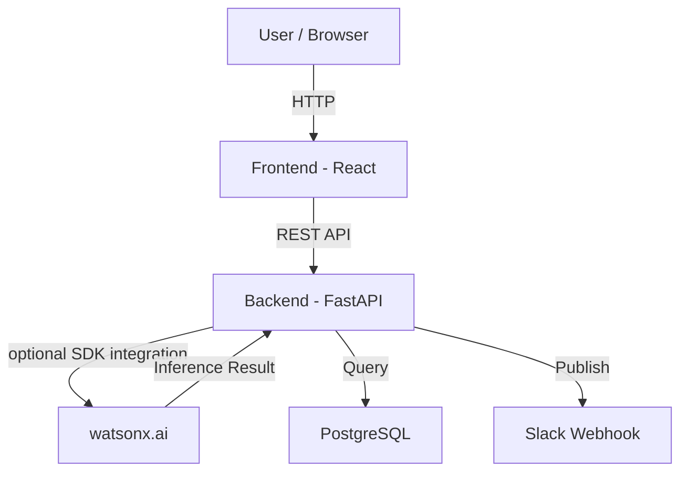

# SupplyShield Architecture

## System Architecture

## Components

| Component | Technology | Responsibility |
|---|---|---|
| Frontend | React 18, TypeScript, Vite, Tailwind | Dashboard and operational investigation UI |
| Backend API | FastAPI, Pydantic, SQLAlchemy | Typed REST APIs and orchestration |
| Deterministic intelligence | Python services | RRI, wallet, Disruption DNA, similarity, and cascade impact |
| Optional AI | watsonx.ai | Isolated explanation layer only when configured |
| Database | PostgreSQL 16 | Shipments, disruptions, wallet ledger, DNA, and sensor readings |

## Data Flow

1. Seeded or future operational records are stored in PostgreSQL.
2. FastAPI queries records and invokes deterministic Python services.
3. The services calculate wallet balances, RRI explanations, DNA features, similarity, and cascade relationships.
4. The React client renders these values with source-aware labels and links a disruption to its affected shipment's wallet.

## Security Considerations

- Credentials are environment variables and `.env` is ignored by Git.
- CORS is restricted to configured local origins by default.
- Deterministic calculations are separate from optional model integrations, preventing generated text from masquerading as a metric.

## Scalability Notes

[Optional: how would this scale beyond the hackathon prototype?]

The FastAPI service is stateless and can scale behind a load balancer. Database indexes exist on primary operational identifiers; production scaling would add connection pooling, authentication, observability, and asynchronous ingestion.
